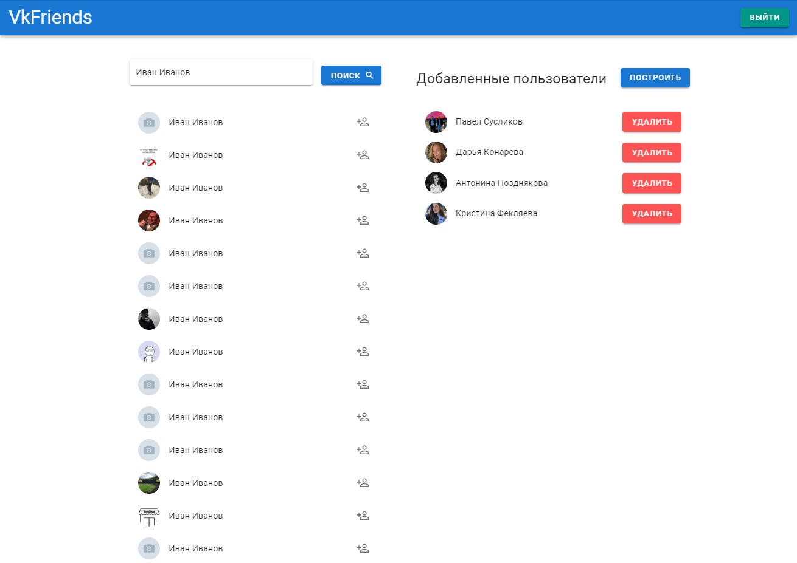
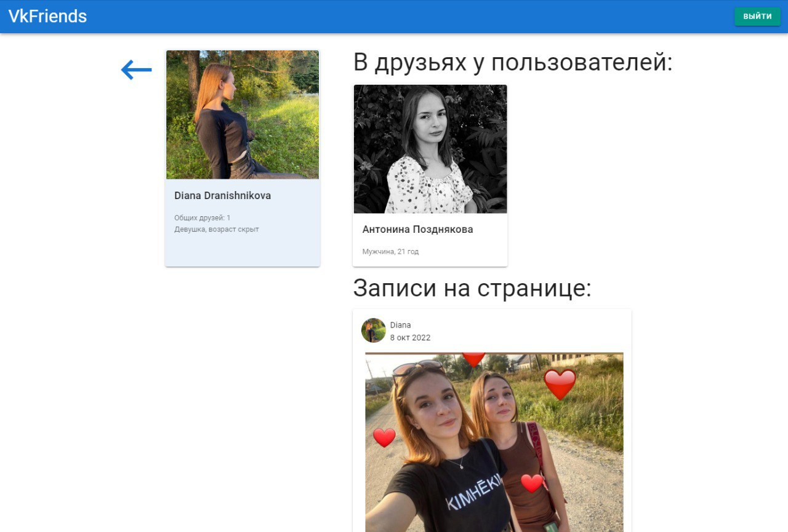
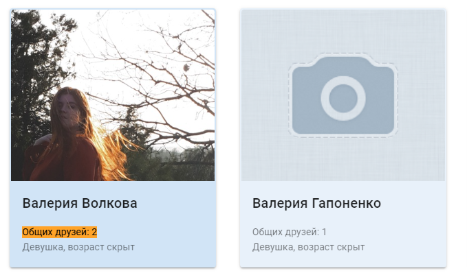

# VkFriend

Функционал приложения:

1)SPA, на базе Vue, позволяющее интерактивно добавлять/удалять пользователей Вк в список по их идентификатору или имени пользователя

2)По кнопке "построить" отображается единый список всех друзей выбранных пользователей (в виде панелей). Пользователи отсортированы по фамилии/имени (с отображением пола, возраста и фотографии). При этом цвет панели друга тем ярче, чем у большего числа выбранных пользователей он находится в друзьях.

3)При клике по другу осуществляется переход на страницу, где отображаются те пользователи, у которых он находится в друзьях, а также записи на его стене.

Проект доступен на GitHub Pages: https://oyshen12.github.io/VkFriends/ 

Для работы приложения нужно зайти через Вконтакте, это нужно только для корректной работы vk api через который осуществляется вся работа приложения. Подробнее об этом и почему это безопасно можно прочитать тут: https://dev.vk.com/api/open-api/getting-started

### Пример работы:


### Поиск и добавление пользователей:


### Страница пользователя:


### Цвет панели ярче у кого больше друзей:


## Project setup
```
npm install
```

### Compiles and hot-reloads for development
```
npm run serve
```

### Compiles and minifies for production
```
npm run build
```

### Customize configuration
See [Configuration Reference](https://cli.vuejs.org/config/).
